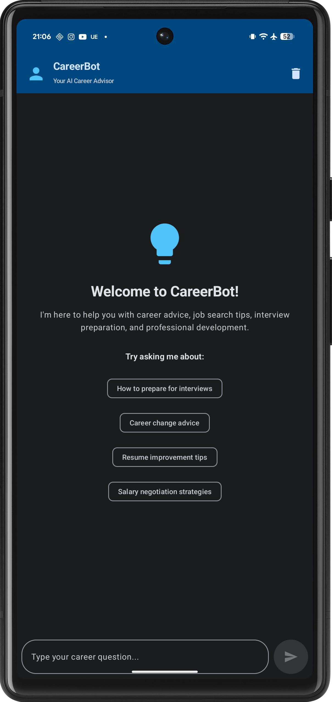
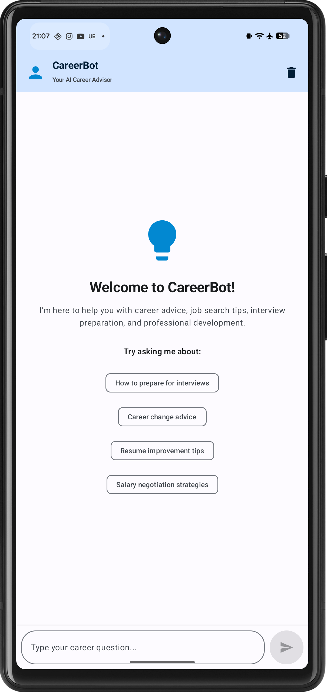

# 🤖 AI Career Bot/Advisor

<p align="center">
  
  
  
  <!--  -->
  
</p>

**Career Bot/Advisor** is a GenAI-powered career Q&A assistant built using **Kotlin** and **Jetpack Compose**. It helps users navigate their career paths by answering questions related to jobs, interviews, resumes, skills, and personal growth.

> Think of it as your personal career coach — available anytime on your Android device.

---

## ✨ Features

- 🧠 **AI-Powered Career Advice**  
  Ask career-related questions and get contextual, intelligent responses.

- 🎨 **Clean Jetpack Compose UI**  
  Built entirely with Jetpack Compose for a modern, responsive interface.

- 📝 **Markdown Support for AI Responses(Pending implementation)**  
  Rich text formatting (bold, italics, lists, links) for a natural and readable chat experience.

- 💬 **Chat-Style Interface**  
  Multi-turn conversation flow to support follow-up questions and clarifications.

- 🔒 **Secure & Lightweight**  
  Works seamlessly with Gemini API and can be extended to integrate with other LLMs.

---

## 📸 Screenshots

### 🌙 Dark Mode



### ☀️ Light Mode



---

## 🚀 Getting Started

### Prerequisites

- Android Studio Hedgehog (or newer)
- Kotlin 1.9+
- Android device or emulator running API 26+

### Clone the Repo

```bash
git clone https://github.com/sylvester-francis/my-career-bot.git
cd my-career-bot
```

### Add Gemini API Key

Create a `local.properties` file (or use BuildConfig for production) and add:

```
GEMINI_API_KEY=your_api_key_here
```

### Run the App

Open the project in Android Studio and click **Run** ▶️ on your emulator or connected device.

---

## 🔧 Tech Stack

- **Language**: Kotlin
- **UI**: Jetpack Compose
- **LLM Backend**: Gemini Pro API (can be swapped with OpenAI, Claude, Mistral, etc.)
- **Architecture**: MVVM with Compose State Management

---

## 🛠️ Future Enhancements

- 🌐 Switch between LLM providers (Gemini, GPT-4, Claude)
- 📚 Fine-tuned model support with user feedback loops
- 📲 Android share intent for AI-generated resumes or tips
- 🧪 Unit + UI Tests with Espresso and Jetpack Compose Test API
- ☁️ Cloud function-based backend for tracking queries (optional)

---

## 🧠 Sample Prompts

- "How do I transition from QA to a software developer role?"
- "Can you help me improve my resume for a backend engineer job?"
- "What skills do I need to become a product manager in AI?"
- "How do I negotiate a job offer at a startup?"

---

## 🤝 Contributing

Pull requests are welcome! For major changes, please open an issue first to discuss your ideas.

---

## 🧑‍💻 Author

Developed by [Sylvester Ranjith Francis](https://github.com/sylvester-francis)

Feel free to reach out or connect on [LinkedIn](https://www.linkedin.com/in/sylvesterranjith/) for collaboration or feedback!
